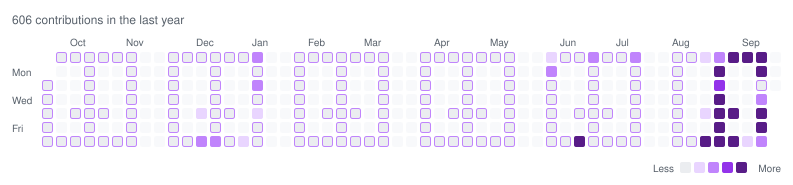

# Custom contribution grid: setup

A second, GitHub-style grid for your profile. It **reads** your real contribution data and **draws** it through a template you design. It never writes to, edits or fabricates your actual contributions or streak.

## How it works

```
GitHub Actions (every 6h + on config change)
        │
        ▼
scripts/generate.mjs ──► GraphQL API: your real daily contribution counts
        │
        ├─ template (templates/*.txt or text) decides WHICH cells are part of the design
        └─ real count decides each cell's COLOUR (thresholds are configurable)
        ▼
dist/grid-light.svg + dist/grid-dark.svg  ──►  committed  ──►  embedded in README
```

## Install (5 minutes)

1. Your profile README lives in a repo named exactly like your username (`<username>/<username>`). Copy everything in this folder into that repo (keep `.github/`).
2. In the repo: **Settings → Actions → General → Workflow permissions → Read and write permissions**.
3. *(Optional, only for private contributions)* Create a token at Settings → Developer settings → Personal access tokens with the `read:user` scope, add it to the repo as a secret named `GH_PAT`, and make sure **Profile settings → "Include private contributions on my profile"** is ticked. Without it, the built-in token is used and only public contributions are counted.
4. **Actions → Update contribution grid → Run workflow**. This generates `dist/grid-light.svg` and `dist/grid-dark.svg`.
5. Paste the block from `README.md` into your profile README:

```html
<picture>
  <source media="(prefers-color-scheme: dark)" srcset="./dist/grid-dark.svg">
  
</picture>
```

From then on it refreshes every 6 hours (edit the `cron` line in the workflow to change that) and whenever you change the config, a template or the script.

## Designing a template

Draw in any text file inside `templates/`, then point `grid.config.json → template` at it.

```text
// comments start with // or ;
0110110
1111111
0111110
0011100
```

* **On:** `1 # X x █ ● ■ *`  **Off:** `0 . space` or any other character.
* **Rows = weekdays**, top row is Sunday, bottom row is Saturday. The calendar always has 7 rows.
* **Columns = weeks**, oldest on the left.
* Ragged lines are padded with "off".
* Templates shorter than 7 rows are padded (`layout.valign`); taller ones are cropped, or squashed with `layout.rows: "scale"`.

### Letters and numbers without drawing

```json
{ "text": "HELLO", "layout": { "fit": "center" } }
```

Built-in 5×7 font: `A-Z 0-9 space - . !`. About 8 characters fit in 53 weeks.

### Layout options (`layout`)

| Option | Values | Meaning |
|---|---|---|
| `fit` | `tile` / `center` / `left` / `right` / `stretch` | Repeat the design across the year, place it once, or resample it to fill the whole grid |
| `gap` | number | Blank columns between tiles (`tile`) |
| `offset` | number | Shift the design by N columns |
| `valign` | `top` / `center` / `bottom` | Where a short template sits vertically |
| `rows` | `pad` / `scale` | Pad/crop to 7 rows, or resample |
| `anchor` | `grid` / `date` | `grid`: the design stays put on screen. `date`: it scrolls left week by week, like the real calendar (`tile` only; set `anchorDate`) |
| `invert` | `true` / `false` | Swap inside and outside of the design |

## Colour levels

The real count of each day picks the level. Defaults:

| Contributions | Level |
|---|---|
| 0 | empty |
| 1-2 | 1 |
| 3-5 | 2 |
| 6-9 | 3 |
| 10+ | 4 |

Change them with `"thresholds": [1, 3, 6, 10]`. These are the minimum counts for levels 1-4 and must strictly increase.

## Other settings

| Setting | Values | Meaning |
|---|---|---|
| `outside` | `ghost` / `hidden` / `dim` | Cells outside the design: faint empty squares, not drawn, or your real data faded |
| `outsideOpacity` | `0`-`1` | Fade strength for `ghost`/`dim` |
| `showPatternHint` | `true`/`false` | Outline design cells that had 0 contributions so the shape stays visible |
| `theme` | `github` / `ocean` / `sunset` / `purple` | Colour preset |
| `colors` | `{ "light": {...}, "dark": {...} }` | Override `levels` (4 colours), `empty`, `text`, `hint`, `background` |
| `appearance` | see `DEFAULTS` in the script | Cell size/gap/radius, month/day labels, legend, total |
| `weeks` | 1-53 | Columns to show |

## Preview a design locally (no token needed)

```bash
node scripts/generate.mjs --demo --ascii     # random data, writes to ./preview (git-ignored)
node scripts/generate.mjs --demo --template templates/invader.txt
node scripts/generate.mjs --demo --text "2026"
```

`--ascii` prints the design mapped onto the calendar (digit = level, `o` = design cell with no activity, `·` = outside the design). Demo data is random and is only ever written to `preview/`. Never publish it.

To run against your real data locally: `GH_TOKEN=<token> GITHUB_USERNAME=<you> node scripts/generate.mjs`.

## Things worth knowing

* **The design only appears where you actually contributed.** A design cell on a day with 0 contributions stays empty (outlined, if `showPatternHint` is on). Dense designs such as diamonds, checkers or wide blocks read well when you're active most days. Sparse ones need a consistent streak. `fit: "tile"` with small shapes is the most forgiving.
* GitHub buckets contributions by day in your profile timezone. The script uses those dates as-is.
* Only the most recent 53 weeks are available from one API call.
* Scheduled workflows in public repos are paused after 60 days without repo activity. The bot commit whenever the SVG changes usually keeps it alive, but if the grid stops updating, re-enable it under the Actions tab.
* The SVG contains no timestamps, so the workflow only commits when the picture actually changes.
