# Streak card setup

Generates `profile-streak.svg`: total contributions, current streak, longest streak, and a
53-week grid where the squares of your current streak glow neon. Read-only: it never touches
your real contributions.

## Install
1. Put these files in your profile repo (`<username>/<username>`), keeping the folder layout:
   `scripts/generate-streak.mjs`, `templates/profile-streak.template.svg`, `.github/workflows/update-streak.yml`.
2. **Settings → Actions → General → Workflow permissions → Read and write permissions.**
3. *(Optional, for private contributions)* create a token with the `read:user` scope, save it as a repo
   secret named `GH_PAT`, and tick **"Include private contributions on my profile"** in your profile settings.
   Without it only public contributions count.
4. **Actions → Update streak card → Run workflow.** After that it runs every 24 hours.
5. Add this to your README.md:

```markdown

```

(To show it from a different repo, use the raw URL:
`https://raw.githubusercontent.com/<username>/<username>/main/profile-streak.svg`)

## How the numbers are calculated
* **Total**: every contribution across all years with activity (one API request per year, because GitHub caps a query at one year).
* **Streak**: consecutive days with at least one contribution.
* **Current streak**: counted back from the newest day GitHub returns. If that day has no contributions *yet*,
  the streak is counted through the day before, so it doesn't show as broken in the morning. Two empty days in a row end it.
* **Longest streak**: the longest run in your whole history (the most recent one wins a tie).
* Day boundaries are whatever GitHub reports for your profile; the script does no timezone math of its own.

## Customising
* **Look:** edit `templates/profile-streak.template.svg` (colours, fonts, layout, text). Placeholders in double curly
  braces (`{{TOTAL}}`, `{{CURRENT_STREAK}}`, `{{GRID}}`, ...) are filled in by the script. Keep the grid origin
  `translate(50,204)` and the script's `CONFIG.grid` (53 weeks, 11px cells, 3px gap) in sync if you resize things.
* **Neon colours:** `CONFIG.neon` at the top of the script; the template gradients follow automatically.
* **Brightness of ordinary active days:** `CONFIG.thresholds` (min contributions for level 1-4), colours `.a1`-`.a4` in the template.
* **Schedule:** the `cron` line in the workflow.

## Preview without a token
`node scripts/generate-streak.mjs --demo` writes random data to `preview/` (git-ignored). Never publish that file.

## Good to know
* The SVG contains a CSS pulse animation on the streak squares. It plays in the README and respects reduced-motion settings.
* Scheduled workflows in public repos get paused after 60 days without repo activity. The daily commit normally keeps it alive;
  if the card ever stops updating, re-enable the workflow in the Actions tab.
